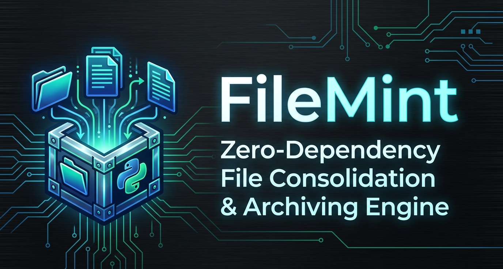
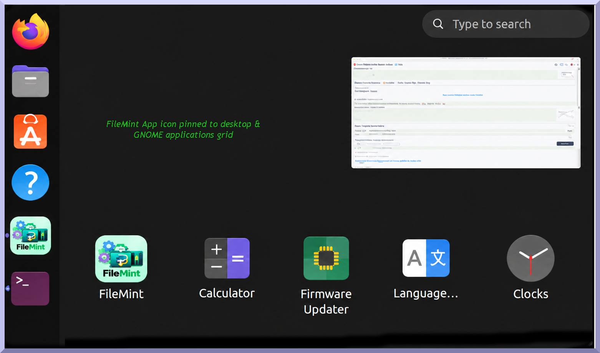
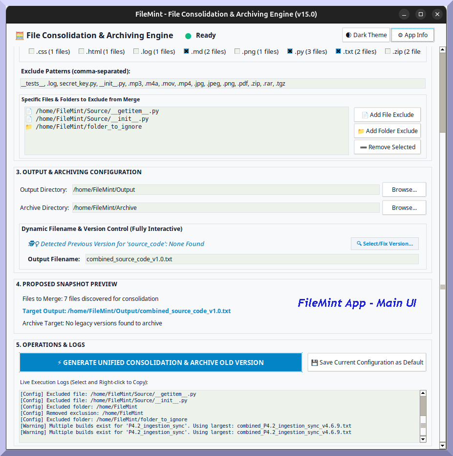
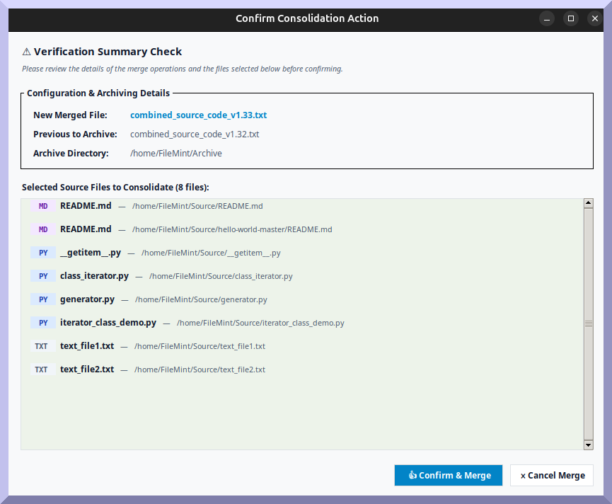
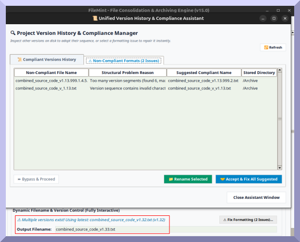
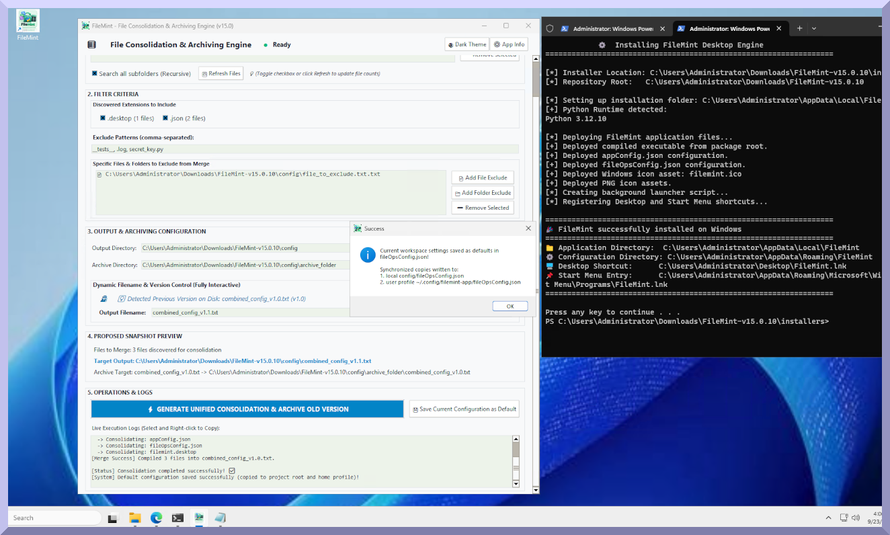

<div style="text-align: center;">

  <!-- Main Banner -->
  

  <br/><br/>
  <!-- Badges -->
  <a href="https://github.com"></a>
  <a href="https://python.org"></a>
  <a href="https://www.gnu.org/licenses/"></a>
  <a href="#"></a>
  <a href="#"></a>

 <br/><br/>

 [](https://github.com/encloudme/FileMint/releases/latest)

<h3>⚡ Zero-Dependency Data Sanitization & Codebase Archiving Engine</h3>
  <p>A high-performance desktop utility for offline file consolidation, metadata cleaning, versioning enforcement, and automated archiving.</p>

**[Quick Start](#quick-start)** |
**[Synopsis](#synopsis)** |
**[Visual Showcase](#visual-showcase)** |
**[Key Features](#key-features)** |
**[Architecture](#architecture)** |
**[Downloads](#downloads-releases)**


</div>
<a id="top-header"></a>

---

## 🌟 Overview

**FileMint** is a native, high-speed Python desktop engine built for developers, system administrators, and security-conscious professionals who need to merge, organize, and archive complex file structures without relying on heavy external dependencies or cloud connectivity.

Operating entirely **offline and locally**, FileMint provides automated multi-segment regex versioning, dynamic compliance auditing, legacy version archiving, and single-click desktop integration for Linux (GNOME) and Windows environments.

---
<a id="quick-start"></a>
## 🚀 Quick Start

### Option 1: Run Pre-Compiled Binary (No Python Needed)
```bash
# Extract Linux Tarball package
tar -zxvf filemint_v15.0.2.tar.gz
cd FileMint-v15.0.2

# Launch standalone binary
./FileMint-v15.0.2
```

### Option 2: Native GNOME Desktop Installation
```bash
# Run automated installer
chmod +x installers/install.sh
./installers/install.sh
```
*Creates a system application launcher under **Office / Development** menu with native icon support.*

---
# 📸 Visual Showcase & Key Features             


_<a id="synopsis"></a>_

> ### 📖 Project Synopsis     👉   _[View / Download Project Synopsis (PDF)](./documentation/FileMint_Project_Synopsis_v2.0.pdf?raw=true)_

---
<a id="visual-showcase"></a>
### 🖼️ Visual Showcase   


> **Note:** Screenshots demonstrate FileMint executing cleanly within a zero-dependency Linux GNOME virtual environment.

|                                             Desktop Integration & Launcher                                             |                                          Main Consolidation Interface                                          |
|:----------------------------------------------------------------------------------------------------------------------:|:--------------------------------------------------------------------------------------------------------------:|
|                                                |                                                     |
| *Native GNOME desktop shortcut registration, application menu indexing (`StartupWMClass=FileMint`), and dock pinning.* | *Tkinter GUI featuring real-time version sniffing, dynamic extension discovery, and preset dark/light themes.* |

|                                              Verification & Merge Modal                                               |                                            Compliance Assistant & Version History                                            |
|:---------------------------------------------------------------------------------------------------------------------:|:----------------------------------------------------------------------------------------------------------------------------:|
|                                              |                                                  |
| *Verification summary detailing target outputs, archive destinations, file extension badges, and file list previews.* | *Interactive assistant auditing compliant version histories, detecting naming collisions, and offering batch on-disk fixes.* |

|                              Windows Installation & Merge Confirmation                               |
|:----------------------------------------------------------------------------------------------------:|
|  |
|    *Windows installation summary, Desktop and Task bar icons, and File merge completion preview.*    |


_[[Home ⤴︎ ]](#top-header)_

---

<a id="key-features"></a>
### ✨ Key Features

- **🚀 Zero-Dependency Standalone Binary Compilation**:
  - Pre-compiled Python-to-C executable compiled via **Nuitka** with optimal payload compression (`zstandard`).
  - Runs natively on target Linux machines without requiring pre-installed system Python modules, virtual environments, or `python3-tk` packages.

- **🏷️ Regex-Driven Versioning & Overwrite Protection**:
  - Enforces strict naming syntax (`combined_*_vN.N.N.N.txt`, `merged_*`, `merge_*` with 2 to 4 version segments).
  - Automatically scans `Output/` and `Archive/` directories to sniff existing builds and suggest the next auto-incremented version (e.g., `v1.0.0.0` $\rightarrow$ `v1.0.0.1`).
  - Hard blocks downward version overwrites and triggers confirmation popups for identical version overwrites.

- **📦 Pristine Legacy Archiving & Collision Safeguards**:
  - Automatically moves older compilations from the active output path to timestamped archive folders (`_archived_{timestamp}`) during new merges.
  - Prevents circular merge self-consumption when output directories overlap with source directories.

- **🎛️ Dual-Tier Configuration Lifecycle**:
  - **Immutable System Blueprint (`appConfig.json`)**: Dictates path macros (`{HOME}`, `{DOCUMENTS_DIR}`), desktop launcher rules, and regex standards.
  - **Dynamic Operational Settings (`fileOpsConfig.json`)**: Persists user source folder selections, extension toggles, dark/light Obsidian themes, and exclusion rules across sessions via dual-write persistence (`~/.config/filemint-app/` and local `config/`).

- **🐧 Cross-Platform Installation Suite**:
  - **Linux / GNOME**: Interactive bash installer (`install-filemint.sh`) deploying multi-resolution hicolor icons (`16x16` through `512x512`), registering system `.desktop` application shortcuts, and rebuilding GTK icon caches.
  - **Windows**: Batch installer (`install-filemint-win.bat`) creating Start Menu & Desktop `.lnk` shortcuts with custom icon assets.

- **🔒 Cryptographic Verification & Release Automation**:
  - Interactive release script (`build_release.sh`) isolating compilation buffers, generating distribution archives (`.zip` and `.tar.gz`), computing `SHA256SUMS.txt` tables, updating tracking matrices (`FileMint_Release_Tracking_Matrix.xlsx`), and syncing public portfolio directories (`FileMint_Public`).

_[[Home ⤴︎ ]](#top-header)_

---

<a id="architecture"></a>
## 🏛️ Repository Architecture

```text
FileMint/
├── assets/                                 # Common assets directory
│   └── banners/                            # Banner images for README.md
│   │   └── filemint_github_banner.png
│   └── icons/                              # System desktop & app menu icons
│   │   ├── icon.png
│   │   ├── filemint.ico
│   │   └── filemint.png
│   └── screenshots/                        # UI Screenshots 
├── config/                                 # App configurations
│   ├── appConfig.json
│   ├── filemint.desktop
│   ├── fileOpsConfig.json
│   └── fileOpsConfig_prev.json
├── documentation/                          # Project synopsis
│   └── FileMint_Project_Synopsis_v2.0.pdf
├── installers/                             # Installer directory 
│   ├── install-filemint.sh
│   ├── install-filemint-win.bat
│   ├── Quick_Start_Guide_FileMint.md
│   ├── uninstall-filemint.sh
│   └── uninstall-filemint-win.bat
├── releases/                               # Versioned release packages & SHA256 checksums
│   ├── FileMint-v15.0.2
│   ├── FileMint-v15.0.2.exe
│   ├── filemint_v15.0.2.tar.gz
│   ├── filemint_v15.0.2.zip
│   └── SHA256SUMS.txt
└── README.md                               # Showcase Documentation

```
_[[Home ⤴︎ ]](#top-header)_

---

<a id="downloads-releases"></a>
## 📦 Downloads & Releases


---
### 🧩 Release (v15.0.2)

| Release Package               | Target System                 | SHA-256 Checksum                                                   |
|:------------------------------|:------------------------------|:-------------------------------------------------------------------|
| **`FileMint-v15.0.2`**        | Standalone Linux Binary       | `5ccf2ebda83db2cb1ce8347b8a1639ff24e7145c4bbbcb97c7ab6020b8da1d3b` |
| **`FileMint-v15.0.2.exe`**    | Standalone Windows Executable | `c050fb84051eb11eba1e19b884694f372f1c7f50385ae2e00564c868abdf8939` |
| **`filemint_v15.0.2.zip`**    | Cross-Platform Zip Archive    | `b79b8b959818959fa61bc4ec8c08d08433301e87019b1eec5775f3d9fa547e02` |
| **`filemint_v15.0.2.tar.gz`** | Linux POSIX Package           | `c335a4531b986eb22647114377983c9789bd47267aa4a352c84e6a96054ce508` |

**Release Date:** `2026-09-28 22:13:02`


---

<div style="text-align: center;">
  <sub>Developed & Maintained for Secure, Offline Enterprise Operations</sub>
</div>

---
